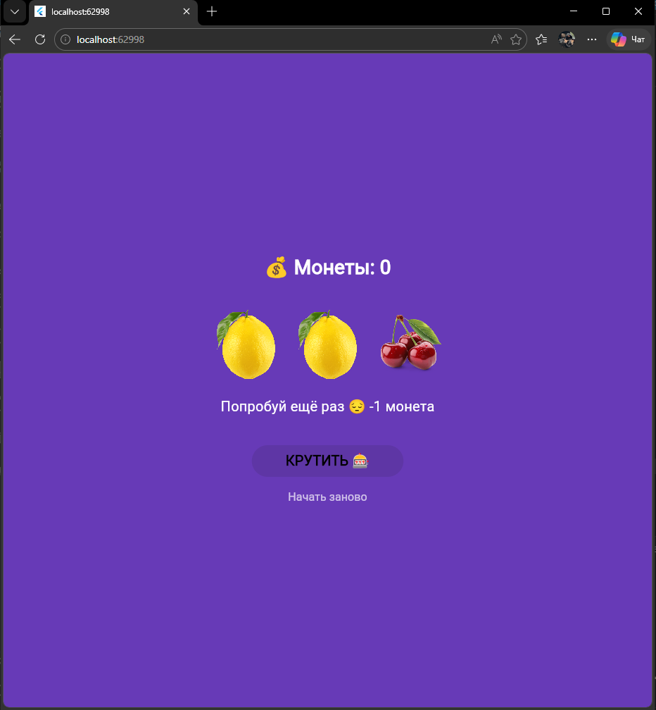

# 🎰 Лабораторная работа №6-7

**Приложение «Слот-машина»** — изучение разницы между StatelessWidget и StatefulWidget, управление состоянием через setState(), работа с локальными изображениями и асинхронная анимация.

---

## 👤 Информация об авторе

| Поле | Значение |
|------|----------|
| **ФИО** | Тотьмянин Тихон Алексеевич |
| **Группа** | ИСП-232 |
| **Дата сдачи** | 31.05.2026 |

---

## 🛠️ Стек и версии

| Технология | Версия |
|------------|--------|
| Flutter | 3.x.x |
| Dart | 3.x.x |
| Платформа | Web (Google Chrome) |

---

## 🖼️ Скриншот приложения



---

## 🚀 Как запустить

1. **Склонируйте репозиторий:**
   ```bash
   git clone <URL_вашего_репозитория>
   ```

2. **Перейдите в папку проекта:**
    ```
    cd slot_machine
    ```

3. **Установите зависимости:**
    ```
    flutter pub get
    ```

4. **Запустите приложение в браузере:**
    ```
    flutter run -d chrome
    ```

## 📚 Что изучили в этой работе

1. StatefulWidget vs StatelessWidget — StatefulWidget хранит состояние в отдельном объекте State и может перестраиваться при изменении данных, в отличие от StatelessWidget который статичен и не меняется после создания.

2. setState() — метод который сигнализирует Flutter о изменении состояния и вызывает перерисовку виджета. Без его использования изменения переменных не отобразятся на экране.

3. Работа с ассетами — подключение локальных изображений через pubspec.yaml в секции assets и использование Image.asset() для их отображения.

4. Асинхронная анимация — создание реалистичной анимации вращения барабанов с помощью async/await, Future.delayed() и поочерёдной остановки барабанов с разной скоростью.

5. Управление состоянием UI — блокировка кнопок во время выполнения операций (onPressed: null), использование флагов (_isSpinning) для предотвращения повторных нажатий и защита от отрицательных значений.

## 🎮 Как играть

1. Нажмите кнопку «КРУТИТЬ 🎰» — барабаны начнут вращаться
2. Дождитесь остановки всех трёх барабанов
3. Если выпали три одинаковых символа — вы получили монеты:
    - Три семёрки 🎰🎰 = +10 монет (Джекпот!)
    - Три одинаковых (вишни или лимоны) = +3 монеты
4. Если символы разные — -1 монета
5. При 0 монет нажмите «Начать заново» для сброса

## 💡 Особенности реализации

- Анимация вращения: три фазы скорости (быстро → медленнее → почти стоп)
- Поочерёдная остановка: барабаны останавливаются с задержкой (10, 13, 16 тиков)
- Визуальная обратная связь: мигание барабанов во время вращения (AnimatedOpacity)
- Анимированный текст: плавная смена сообщений (AnimatedSwitcher)
- Блокировка UI: кнопки неактивны во время вращения
